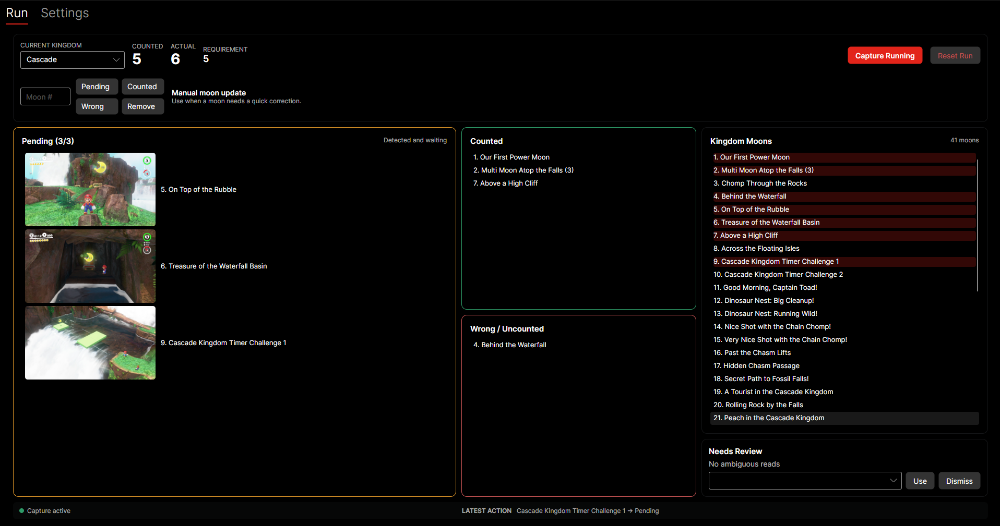

# Aviscribe

Aviscribe is a cross-platform Talkatoo translator for Super Mario Odyssey. Currently only Traditional Chinese gameplay is supported, with output being available in all native Super Mario Odyssey languages. 

Aviscribe works by capturing gameplay from a camera, capture card, virtual camera, or application window,
recognizing Talkatoo and moon collection text, and displaying that info for the user to see.

For support, feedback, and to be notified of new builds, join the [Discord server](https://discord.gg/ADDAuJVxjn).

## Supported platforms

- Windows 10/11 x64
- macOS 14+ on Apple Silicon
- Ubuntu 22.04/24.04 x64
- Other modern glibc-based x64 Linux distributions may work

## Development setup

Aviscribe requires the .NET 10 SDK. The required SDK version is pinned in
[global.json](global.json).

The project uses three private packages built from pinned repositories. From the
repository root, create the local package feed before restoring:

~~~powershell
./tools/build-local-nuget.ps1 -OutputPath ../../LocalNuGet
dotnet restore Aviscribe.sln
~~~

Build, test, and run the desktop application with:

~~~text
dotnet build Aviscribe.sln --configuration Release --no-restore
dotnet test Aviscribe.sln --configuration Release --no-build
dotnet run --project src/Aviscribe.Desktop
~~~

On Windows, open Aviscribe.sln in Visual Studio and use
Aviscribe.Desktop as the startup project if you prefer an IDE workflow.

## Validation

The automated tests are hardware-independent. The classifier tool also provides
smoke checks for the state, capture crop, frame processor, Talkatoo confirmation,
and matcher paths:

~~~text
dotnet run --project tools/Aviscribe.Classifier --configuration Release --no-build -- state-smoke
dotnet run --project tools/Aviscribe.Classifier --configuration Release --no-build -- capture-crop-smoke
dotnet run --project tools/Aviscribe.Classifier --configuration Release --no-build -- frameprocessor-smoke
dotnet run --project tools/Aviscribe.Classifier --configuration Release --no-build -- talkatoo-confirmation-smoke
dotnet run --project tools/Aviscribe.Classifier --configuration Release --no-build -- matcher-smoke
~~~

## Using the application

1. Start Aviscribe and open **Settings > Capture Source**.
2. Select a video device or application window, then start capture.
3. Use **Crop Gameplay** to select the gameplay area when prompted.
4. Configure the run and language, then use the **Run** screen to review pending,
   counted, and uncounted results.

OCR uses the CPU by default. An optional WebGPU processor is available in
**Settings > Setup > OCR processor**. Using the GPU can significantly decrease text/moon recognition times. If it cannot initialize, Aviscribe falls
back to CPU processing.

Capture permissions depend on the platform:

- Windows: allow desktop applications to access cameras.
- macOS: allow Camera and Screen & System Audio Recording access as needed.
- Linux: allow access to /dev/video* devices and install a working
  xdg-desktop-portal ScreenCast backend with PipeWire for Wayland windows.

If a source is not listed after changing permissions or connecting hardware,
refresh the source list and restart Aviscribe if necessary.

## Packaging

The packaging scripts produce self-contained builds for Windows x64, macOS
Apple Silicon, and Linux x64. Set the version first if needed:

~~~powershell
./tools/set-version.ps1 0.6.1
~~~

Run the package script on its target operating system:

~~~powershell
./packaging/windows/package.ps1 -Version 0.6.1
~~~

~~~text
bash packaging/macos/package.sh 0.6.1
bash packaging/linux/package.sh 0.6.1
~~~

Packages and publish outputs are written to artifacts/.

## Repository layout

- src/Aviscribe.Core: run state, moon matching, OCR, and frame processing
- src/Aviscribe.Core.Capture: capture contracts and crop models
- src/Aviscribe.Capture: video-device and platform window capture
- src/Aviscribe.UI: Avalonia views and controls
- src/Aviscribe.Desktop: application entry point
- tools/Aviscribe.Classifier: dataset, detector, OCR, and video analysis tools
- tests: automated tests

The classifier tool has its own usage notes in
[tools/Aviscribe.Classifier/README.md](tools/Aviscribe.Classifier/README.md).

## License

Aviscribe is licensed under the MIT License. See [LICENSE](LICENSE).
